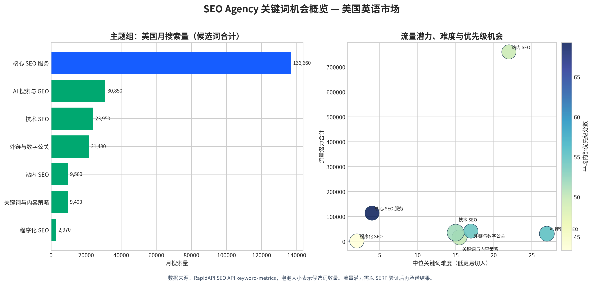

# SEO Agency 关键词策略：美国英语市场

**研究日期：** 2026-08-22

**服务定位：** 面向 B2B SaaS、AI 和开发者工具公司的 SEO Agency

**研究范围：** 76 个服务导向候选关键词；美国英语市场；基于现有服务页与技术 SEO 页面中已明确的服务能力进行词簇设计。[4] [5]

## 执行摘要

本研究通过用户提供的 RapidAPI SEO API 的 `keyword-metrics` 端点，为 76 个候选词取得搜索量、点击、CPC、关键词难度、全球搜索量与流量潜力等原始指标。[1] [2] 这些候选词覆盖 **核心 SEO 服务、站内 SEO、技术 SEO、程序化 SEO、关键词与内容策略、外链与数字公关、AI 搜索与 GEO**，并已经映射到现有或建议新增的页面路径。

在不去重的候选词口径下，76 个关键词合计月搜索量为 **234,960**，合计流量潜力为 **1,001,780**，关键词难度中位数为 **13**。这些合计值用于比较词簇的机会规模，**不能视为可相加的实际流量预测**，因为相近词存在意图与 SERP 重叠。经过以商业意图、搜索量、流量潜力、CPC、点击与难度构成的内部优先级模型筛选，前 20 个词被标为 **P1 — 优先布局**。[2] [3]

> **核心结论：** 先把已有的 `/services/seo-services`、`/services/technical-seo` 与 `/services/geo-services` 做成明确的商业落地页，再新增 **On-Page SEO**、**Link Building** 与 **SEO Content Strategy** 三个高意图服务页。程序化 SEO 应保留为独立服务能力与内容资产，但在完成模板、数据源、索引控制和内链架构的验证前，不应以规模化页面扩张作为第一阶段 KPI。

## 数据范围、方法与限制

RapidAPI 产品说明将该端点定义为关键词指标查询，并返回搜索量、点击、CPC、难度、全球搜索量与流量潜力等字段。[1] 本次采集的完整原始响应保存在 [`raw_keyword_metrics_us.json`](./raw_keyword_metrics_us.json)，清洗后的可筛选表保存在 [`keyword_metrics_us.csv`](./keyword_metrics_us.csv)。[2] [3]

候选词由当前站点的服务承诺反推产生，而不是使用词表随机扩展。具体而言，现有网站已经覆盖 SEO 策略、页面优化、技术建议、内容 Brief、外链机会、GEO、技术审计、JavaScript SEO、迁移、国际化与结构化数据；因此词簇优先聚焦这些实际可交付能力。[4] [5] 这使本研究适用于**决定应创建或优化哪些业务页面**，但它不是全行业的无限词库。

内部 `priority_score` 为 0–100 的排序工具，并非 API 指标、排名预测或收入预测。公式由商业意图乘数与归一化的搜索量、流量潜力、CPC、点击以及难度反向值组合而成；信息型词的意图乘数低于商业型词。每个 P1 页面在进入写作排期前仍应人工审查 SERP、竞品页面类型、地域匹配、品牌差异化与销售可承接性。

`keyword-generator` 端点在当前订阅中返回“endpoint disabled”，因此本次不将其未验证的生成结果混入数据集；所有表内数值均来自已成功返回的 `keyword-metrics` 调用。这也意味着下一轮应在关键词生成权限可用后，围绕每个 P1 词扩展问题词、比较词、替代方案词和行业修饰词，并重新去重与聚类。

| 指标 | 本次结果 | 使用方式 | 注意事项 |
|---|---:|---|---|
| 覆盖候选词 | 76 | 服务架构与选题的起始词库 | 不是全量关键词宇宙 |
| P1 优先词 | 20 | 90 天页面与内容排期 | 需先做 SERP 验证 |
| 合计美国月搜索量 | 234,960 | 比较词簇需求规模 | 相近词会重叠，不可视为预测流量 |
| 合计流量潜力 | 1,001,780 | 发现可由主题覆盖放大的机会 | 部分异常值需人工验证 |
| 难度中位数 | 13 | 发现低难度切入口 | 不等同于排名保证 |

## 主题机会与取舍

下表按候选词的总流量潜力排序。**站内 SEO** 的流量潜力明显偏高，主要受到 `on page seo audit` 的 284,000 流量潜力影响；但其搜索量仅为 1,100 且难度为 82。因此，站内 SEO 是应建设的商业服务页，但这项异常大的潜力值必须先通过 SERP 与竞争页面验证，不能据此承诺结果。[2] [3]

| 主题组 | 候选词数 | 美国月搜索量合计 | 流量潜力合计 | 难度中位数 | P1 数 | 建议 |
|---|---:|---:|---:|---:|---:|---|
| 站内 SEO | 10 | 9,560 | 760,500 | 22.0 | 2 | 新增核心服务页；先用商业词切入，再用审计型指南获客 |
| 核心 SEO 服务 | 10 | 136,660 | 113,950 | 4.0 | 7 | 立即重构现有总服务页，明确 Agency、Consultant、B2B、SaaS 定位 |
| 外链与数字公关 | 10 | 21,480 | 41,950 | 17.0 | 3 | 新增 Link Building 服务页，强调质量、相关性与交付透明度 |
| 技术 SEO | 14 | 23,950 | 35,490 | 15.0 | 3 | 强化已有页；拆分迁移与国际化子主题，避免稀释主页面 |
| AI 搜索与 GEO | 11 | 30,850 | 31,180 | 27.0 | 3 | 将现有 GEO 页改写为 AI SEO / AI SEO Agency 的商业入口 |
| 关键词与内容策略 | 11 | 9,490 | 16,550 | 15.5 | 2 | 新增内容策略页与关键词策略页，承接“strategy”而非泛教程意图 |
| 程序化 SEO | 10 | 2,970 | 2,160 | 2.0 | 0 | 作为差异化能力页与教育内容集群；先验证页面模板和数据质量 |

## P1：优先布局的 20 个关键词

P1 不代表必须为每个词建立一个独立 URL。应以**一个主商业页面承接一个紧密意图簇**，用模块、FAQ、案例、子页面或文章承接长尾变体，避免同意图页面互相蚕食。

| 排名 | 关键词 | 词簇 | 意图 | 美国月搜索量 | CPC（美元） | 难度 | 流量潜力 | 建议落地页 |
|---:|---|---|---|---:|---:|---:|---:|---|
| 1 | seo services | 核心 SEO 服务 | 商业 | 60,000 | 8.0 | 0 | 40,000 | `/services/seo-services` |
| 2 | seo agency | 核心 SEO 服务 | 商业 | 51,000 | 10.0 | 1 | 17,000 | `/services/seo-services` |
| 3 | seo consultant | 核心 SEO 服务 | 商业 | 13,000 | 7.0 | 6 | 27,000 | `/services/seo-services` |
| 4 | link building services | 外链与数字公关 | 商业 | 9,200 | 5.0 | 27 | 16,000 | 新增 `/services/link-building` |
| 5 | seo content strategy | 关键词与内容策略 | 商业 | 3,200 | 2.5 | 20 | 12,000 | 新增 `/services/seo-content-strategy` |
| 6 | technical seo services | 技术 SEO | 商业 | 11,000 | 4.5 | 19 | 7,900 | `/services/technical-seo` |
| 7 | seo strategy services | 核心 SEO 服务 | 商业 | 800 | 8.0 | 0 | 21,000 | `/services/seo-services` |
| 8 | b2b seo agency | 核心 SEO 服务 | 商业 | 4,200 | 17.0 | 10 | 1,900 | `/services/seo-services` |
| 9 | saas seo agency | 核心 SEO 服务 | 商业 | 3,600 | 9.0 | 10 | 2,100 | `/services/seo-services` |
| 10 | ai seo agency | AI 搜索与 GEO | 商业 | 3,600 | 9.0 | 10 | 1,900 | `/services/geo-services` |
| 11 | link building agency | 外链与数字公关 | 商业 | 4,700 | 9.0 | 50 | 15,000 | 新增 `/services/link-building` |
| 12 | keyword strategy | 关键词与内容策略 | 商业 | 1,200 | 4.0 | 11 | 1,100 | 新增 `/services/keyword-research` |
| 13 | on page seo services | 站内 SEO | 商业 | 3,300 | 5.0 | 6 | 2,500 | 新增 `/services/on-page-seo` |
| 14 | website migration seo | 技术 SEO | 商业 | 800 | 10.0 | 12 | 4,600 | `/services/technical-seo` |
| 15 | digital pr agency | 外链与数字公关 | 商业 | 2,500 | 13.0 | 26 | 1,900 | 新增 `/services/link-building` |
| 16 | on page seo audit | 站内 SEO | 商业 | 1,100 | 9.0 | 82 | 284,000 | 新增 `/services/on-page-seo`；先验证 SERP |
| 17 | saas seo consultant | 核心 SEO 服务 | 商业 | 900 | 25.0 | 2 | 350 | `/services/seo-services` |
| 18 | geo services | AI 搜索与 GEO | 商业 | 700 | 6.0 | 54 | 9,000 | `/services/geo-services` |
| 19 | ai seo services | AI 搜索与 GEO | 商业 | 4,500 | 1.1 | 6 | 2,100 | `/services/geo-services` |
| 20 | international seo services | 技术 SEO | 商业 | 2,500 | 1.1 | 6 | 4,100 | `/services/technical-seo` |

## 页面架构与关键词映射

现有总服务页不应只是服务目录。它应成为商业意图的总入口，直接说明对 SaaS、AI 与技术团队的交付模式、SEO strategy、on-page、technical、content、authority 与 reporting；同时用站内链接将访客导向解决特定问题的服务页。现有技术 SEO 页面已经有实施型定位、开发可执行工单、JavaScript、Core Web Vitals、迁移、国际化及结构化数据内容，可承接大量技术长尾词。[4] [5]

| 页面 | 状态 | 主关键词 | 应覆盖的次级关键词 | 页面必须证明什么 | 关键内链 |
|---|---|---|---|---|---|
| `/services/seo-services` | 优化现有 | seo services | seo agency, seo consultant, b2b seo agency, saas seo agency, seo strategy services | 服务如何从策略到实施；谁执行；每月交付什么；为什么适合 B2B SaaS/AI | 链接至 Technical、On-Page、Content Strategy、Link Building、GEO |
| `/services/technical-seo` | 优化现有 | technical seo services | website migration seo, international seo services, JavaScript SEO, core web vitals audit, hreflang audit | 诊断如何进入工程排期、验证与监测 | 返回总服务页；链接至 On-Page、pSEO 指南与迁移指南 |
| `/services/geo-services` | 优化现有 | ai seo services | ai seo agency, generative engine optimization, geo services, ai search optimization, ChatGPT SEO | AI 可见度诊断、可引用内容、实体与分发如何协同 | 链接至 Content Strategy、SEO Services、Reddit 相关服务 |
| `/services/on-page-seo` | 新建 | on page seo services | on page seo audit, content optimization services, landing page seo, product page seo, internal linking service | 页面优化如何连接搜索意图、实体信息、内链与转化路径 | 链接至 SEO Services、Technical、Content Strategy |
| `/services/link-building` | 新建 | link building services | link building agency, SaaS link building, B2B link building, digital PR agency, white hat link building | 相关性、质量筛选、锚文本风险、目标页、交付记录与 PR 协同 | 链接至 SEO Services、Content Strategy、相关案例/资源页 |
| `/services/seo-content-strategy` | 新建 | seo content strategy | seo content services, seo content audit, SEO content briefs, B2B SEO content, topical authority SEO | 如何从关键词策略变成可发布的 Brief、内容集群与内部链接 | 链接至 Keyword Research、On-Page、GEO |
| `/services/keyword-research` | 新建或并入 Content Strategy | keyword strategy | keyword research services, commercial content strategy | 如何按意图、页面类型、竞争与产能选择主题 | 链接至 Content Strategy、SEO Services、pSEO 评估 |
| `/services/programmatic-seo` | 新建但低优先级 | programmatic seo | programmatic SEO services, scalable SEO pages, integration pages SEO | 只有在模板、数据、去重、canonical、内链、索引质量受控时才规模化 | 链接至 Technical SEO、Content Strategy、pSEO guides |

## 各服务页面的写作规则

每个商业页面都应以一个主词簇为中心，标题与 H1 直接表达服务，不要机械重复关键词。页面正文应先描述适用的客户和问题，再展示工作流、交付物、质量控制、协作边界、可验证的案例证据或示例，最后给出与服务匹配的咨询 CTA。FAQ 应回答采购阶段的问题，例如“是否包含实施”“如何与开发团队合作”“适合什么规模的 SaaS 网站”“如何衡量进展”，而不是只定义 SEO 概念。

对于 `/services/seo-services`，建议在 H2 级模块中清晰覆盖 `B2B SEO Agency`、`SaaS SEO Agency`、`SEO Consultant`、`SEO Strategy`；这些应该是同一商业服务的行业或合作方式模块，而不是为了匹配词而创建内容高度重复的页面。对于技术 SEO，迁移、国际化和 JavaScript SEO 可以先做为强模块与 FAQ，只有独立案例、独立销售需求和 SERP 明显偏向专页时再拆成子页面。

## 内容集群与支持性文章

商业页需要支持性内容建立主题深度和内部链接。下表的内容仅在能链接到明确服务页、包含独特案例或实践框架时生产；不要为了覆盖关键词而发布泛化的“什么是 SEO”文章。

| 内容集群 | 首篇内容资产 | 支持关键词 | 主商业落地页 | 建议 CTA |
|---|---|---|---|---|
| On-Page SEO | `On-Page SEO Audit: A B2B SaaS Implementation Checklist` | on page seo audit, on page seo checklist, product page SEO | `/services/on-page-seo` | 请求页面与内容优化审查 |
| Technical SEO | `Website Migration SEO Checklist for SaaS Teams` | website migration SEO, SEO migration service, indexation audit | `/services/technical-seo` | 获取迁移风险评估 |
| JavaScript SEO | `JavaScript SEO for Product-Led SaaS: Rendering, Indexing and Validation` | JavaScript SEO, JavaScript SEO audit, crawl budget optimization | `/services/technical-seo` | 获取渲染与索引审查 |
| Content Strategy | `How to Turn Keyword Strategy into a SaaS Content Production Queue` | keyword strategy, SEO content briefs, SaaS content strategy | `/services/seo-content-strategy` | 获取内容策略工作坊 |
| Link Building | `What B2B SaaS Link Building Should Measure Beyond Link Count` | SaaS link building, B2B link building, backlink strategy | `/services/link-building` | 获取外链机会审查 |
| pSEO | `Programmatic SEO Examples: When Scalable Pages Help — and When They Create Index Bloat` | programmatic SEO examples, template SEO, directory SEO strategy | `/services/programmatic-seo` | 申请 pSEO 可行性评估 |
| AI SEO / GEO | `AI SEO for B2B: Building Content That AI Search Can Understand and Cite` | AI SEO, generative engine optimization, ChatGPT SEO | `/services/geo-services` | 获取 AI visibility baseline |

## 程序化 SEO 的专项判断

程序化 SEO 词簇的候选搜索量较小（2,970），难度中位数低（2），但没有进入 P1 的词。这说明它更适合作为面向成熟 SaaS/AI/开发者工具客户的**差异化交付能力**，而不是现阶段的头号自然流量入口。站点现有技术 SEO 页面已经提及大规模 integration pages、抓取、索引、canonical、sitemap 与重复 URL 风险，这为 pSEO 的可信切入提供了基础。[5]

在公开发布 pSEO 服务页或大规模落地页前，应完成数据字段覆盖率审计、模板内容唯一性规则、分页与筛选 URL 控制、canonical/noindex 策略、内部链接生成逻辑、站点地图分片、日志或 Search Console 监测方案，以及一个小规模试验目录。首批项目应以几十个高价值 URL 验证收录与转化，再决定是否扩大，而不是一次性发布数千个近似页面。

## 90 天执行顺序

| 时间 | 重点 | 交付物 | 成功判断 |
|---|---|---|---|
| 第 1–2 周 | 核心商业页与技术基础 | 重写 `/services/seo-services`、`/services/technical-seo`、`/services/geo-services` 的 title、H1、模块、FAQ 与内链；完成关键词到页面的唯一映射 | 每个 P1 主词有唯一商业主页面；无明显关键词蚕食 |
| 第 3–5 周 | 新服务页 | 发布 On-Page SEO 与 Link Building 页面；制作一个公开可见的交付物样例或匿名案例 | 新页面可被抓取与索引；CTA、交付边界与相邻服务内链完整 |
| 第 6–8 周 | 内容策略与支持性内容 | 发布 SEO Content Strategy 页面，并完成 On-Page、Migration、JavaScript、Link Building 四篇支持内容 | 每篇文章至少有一个服务页 CTA 和 3–5 条上下文内链 |
| 第 9–10 周 | Keyword Strategy 与 GEO 强化 | 发布或并入 Keyword Research 页面；改写 GEO 页以匹配 AI SEO Services / Agency 意图 | 商业页覆盖目标词簇，且不弱化已有 GEO 定位 |
| 第 11–12 周 | pSEO 试点与复盘 | pSEO 可行性页、模板与数据 QA 清单；通过 Search Console 复查收录、展示、点击和目标页行为 | 确定是否具备扩大 pSEO 的索引与数据条件 |

## 测量与复盘框架

关键词排序不是结果本身。应在 Search Console、分析工具和 CRM 中按页面组建立基线，至少每月审查索引状态、展示量、非品牌点击、目标词排名区间、服务页 CTA 点击、表单转化与合格线索。将目标词分为“主商业词”“相邻商业词”“信息支持词”，并只在页面意图与用户需求一致时衡量排名变化。

对于 P1 词，应在页面发布后 4–8 周检查是否获得展示；若未获得展示，先检查索引、canonical、内部链接、页面主题清晰度与 SERP 意图匹配，而不是立刻增加关键词密度。对于异常高的流量潜力或异常低的难度，先保存当前 SERP 截图、竞品页面类型和数据快照，确认该信号能经受人工审查后再用于预测或销售叙事。

## 交付文件说明

| 文件 | 用途 |
|---|---|
| [`keyword-strategy-us.md`](./keyword-strategy-us.md) | 本策略文档：优先级、页面架构、内容计划与实施顺序 |
| [`keyword_metrics_us.csv`](./keyword_metrics_us.csv) | 76 个候选词的完整可筛选指标表与建议落地页 |
| [`cluster_summary_us.csv`](./cluster_summary_us.csv) | 7 个主题组的聚合指标与优先级概览 |
| [`raw_keyword_metrics_us.json`](./raw_keyword_metrics_us.json) | 来自 API 的原始响应记录，便于审计和复算 |
| [`keyword_opportunity_by_cluster.png`](./keyword_opportunity_by_cluster.png) | 主题机会可视化摘要 |

## References

[1]: https://rapidapi.com/apiverse1-apiverse-default/api/seo-api-dr-rd-rank-keywords-backlinks1 "RapidAPI — SEO API: DR, RD, Rank, Keywords, Backlinks"
[2]: ./raw_keyword_metrics_us.json "RapidAPI keyword-metrics raw responses (US)"
[3]: ./keyword_metrics_us.csv "Normalized keyword metrics and page mapping"
[4]: ../../src/content/services.ts "Current Agency service catalog"
[5]: ../../src/content/technical-seo.ts "Current technical SEO service content"
